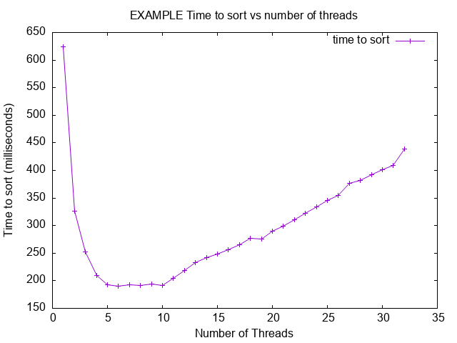

# Submission Report

- Submission generated at 09/18/2026 at 03:12:16

- Machine info: Linux runnervmlun5p 6.17.0-1022-azure #22-Ubuntu SMP Mon Jul 27 17:24:03 UTC 2026 x86_64 x86_64 x86_64 GNU/Linux

## Note to Students

Please read this report carefully before submission.
Ensure that all sections are complete and accurate.
Look for any errors in the build or test outputs.
If you find any issues, correct them before submitting.
Post any questions on the class discussion board for help.


---

## README

# Project X

- Name: John Doe
- Email: johndoe@u.boisestate.edu
- Class: CS123-001

## Known Bugs or Issues

TODO: Are there any known issues?

## Experience

TODO: Describe your experience with the project (struggles, breakthroughs, etc.).

## Analysis

TODO: Provide your analysis of the results. If the assignment does not require
analysis, you can remove this section.

Here is an example of how to include a plot in your README:



---


## Build Output

This section was generated by running `make all` in the project root directory.

```bash
make[1]: Entering directory '/home/runner/work/cs425-p1/cs425-p1'
mkdir -p build/debug
cc -g -O0 -DDEBUG -fno-omit-frame-pointer -fsanitize=address -c src/main.c -o build/debug/main.c.o
mkdir -p build/debug
cc -g -O0 -DDEBUG -fno-omit-frame-pointer -fsanitize=address -c src/lab.c -o build/debug/lab.c.o
cc -g -O0 -DDEBUG -fno-omit-frame-pointer -fsanitize=address build/debug/main.c.o build/debug/lab.c.o -o build/debug/myapp_d -fsanitize=address
make[1]: Leaving directory '/home/runner/work/cs425-p1/cs425-p1'
make[1]: Entering directory '/home/runner/work/cs425-p1/cs425-p1'
mkdir -p build/release
cc -Wall -Wextra -O2 -fPIE -MMD -MP -Wformat -Wformat=2 -Wconversion -Wsign-conversion -Wimplicit-fallthrough -fstack-protector-strong -Werror=format-security -Werror=implicit -Werror=incompatible-pointer-types -Werror=int-conversion -c src/main.c -o build/release/main.c.o
mkdir -p build/release
cc -Wall -Wextra -O2 -fPIE -MMD -MP -Wformat -Wformat=2 -Wconversion -Wsign-conversion -Wimplicit-fallthrough -fstack-protector-strong -Werror=format-security -Werror=implicit -Werror=incompatible-pointer-types -Werror=int-conversion -c src/lab.c -o build/release/lab.c.o
cc -Wall -Wextra -O2 -fPIE -MMD -MP -Wformat -Wformat=2 -Wconversion -Wsign-conversion -Wimplicit-fallthrough -fstack-protector-strong -Werror=format-security -Werror=implicit -Werror=incompatible-pointer-types -Werror=int-conversion build/release/main.c.o build/release/lab.c.o -o build/release/myapp 
make[1]: Leaving directory '/home/runner/work/cs425-p1/cs425-p1'
make[1]: Entering directory '/home/runner/work/cs425-p1/cs425-p1'
mkdir -p build/tests
cc -g -O0 -DTEST -fprofile-arcs -ftest-coverage -c src/main.c -o build/tests/main.c.o
mkdir -p build/tests
cc -g -O0 -DTEST -fprofile-arcs -ftest-coverage -c src/lab.c -o build/tests/lab.c.o
mkdir -p build/tests/
cc -g -O0 -DTEST -fprofile-arcs -ftest-coverage -c tests/lab-test.c -o build/tests/lab-test.c.o
mkdir -p build/tests/harness/
cc -g -O0 -DTEST -fprofile-arcs -ftest-coverage -c tests/harness/unity.c -o build/tests/harness/unity.c.o
cc -g -O0 -DTEST -fprofile-arcs -ftest-coverage build/tests/main.c.o build/tests/lab.c.o build/tests/lab-test.c.o build/tests/harness/unity.c.o -o build/tests/myapp_t -fprofile-arcs -ftest-coverage
make[1]: Leaving directory '/home/runner/work/cs425-p1/cs425-p1'
make[1]: Entering directory '/home/runner/work/cs425-p1/cs425-p1'
mkdir -p build/debug-test
cc -g -O0 -DDEBUG -DTEST -fno-omit-frame-pointer -fsanitize=address -c src/main.c -o build/debug-test/main.c.o
mkdir -p build/debug-test
cc -g -O0 -DDEBUG -DTEST -fno-omit-frame-pointer -fsanitize=address -c src/lab.c -o build/debug-test/lab.c.o
mkdir -p build/debug-test/
cc -g -O0 -DDEBUG -DTEST -fno-omit-frame-pointer -fsanitize=address -c tests/lab-test.c -o build/debug-test/lab-test.c.o
mkdir -p build/debug-test/harness/
cc -g -O0 -DDEBUG -DTEST -fno-omit-frame-pointer -fsanitize=address -c tests/harness/unity.c -o build/debug-test/harness/unity.c.o
cc -g -O0 -DDEBUG -DTEST -fno-omit-frame-pointer -fsanitize=address build/debug-test/main.c.o build/debug-test/lab.c.o build/debug-test/lab-test.c.o build/debug-test/harness/unity.c.o -o build/debug-test/myapp_td -fsanitize=address
make[1]: Leaving directory '/home/runner/work/cs425-p1/cs425-p1'
Builds completed. You can run the application with: ./build/release/myapp
You can run the debug build with: ./build/debug/myapp_d
You can run the test build with: ./build/tests/myapp_t
You can run the debug-test build with: ./build/debug-test/myapp_td
```

---

## Coverage Report

This section was generated by running `make report` in the project root directory.

```bash
Unexpected SMTP reply: 500 no
Unexpected SMTP reply: 500 no
Unexpected SMTP reply: 500 no
Unexpected SMTP reply: 500 no
Unexpected SMTP reply: 500 no
Unexpected SMTP reply: 500 no
Unexpected SMTP reply: 500 no
Unexpected SMTP reply: tests/lab-test.c:349:test_pure_helpers:PASS
tests/lab-test.c:350:test_reply_code_errors:PASS
tests/lab-test.c:351:test_dot_stuff_edges:PASS
tests/lab-test.c:352:test_read_line_and_reply:PASS
tests/lab-test.c:353:test_read_errors:PASS
tests/lab-test.c:354:test_write_and_command_errors:PASS
tests/lab-test.c:355:test_session_success:PASS
tests/lab-test.c:356:test_session_wrong_statuses:PASS
tests/lab-test.c:357:test_session_hangup:PASS
tests/lab-test.c:358:test_socket_functions:PASS
tests/lab-test.c:359:test_socket_connect:PASS
tests/lab-test.c:360:test_close:PASS

-----------------------
12 Tests 0 Failures 0 Ignored 
OK
./build/tests/myapp_t
Unexpected SMTP reply: 500 no
Unexpected SMTP reply: 500 no
Unexpected SMTP reply: 500 no
Unexpected SMTP reply: 500 no
Unexpected SMTP reply: 500 no
Unexpected SMTP reply: 500 no
Unexpected SMTP reply: 500 no
Unexpected SMTP reply: tests/lab-test.c:349:test_pure_helpers:PASS
tests/lab-test.c:350:test_reply_code_errors:PASS
tests/lab-test.c:351:test_dot_stuff_edges:PASS
tests/lab-test.c:352:test_read_line_and_reply:PASS
tests/lab-test.c:353:test_read_errors:PASS
tests/lab-test.c:354:test_write_and_command_errors:PASS
tests/lab-test.c:355:test_session_success:PASS
tests/lab-test.c:356:test_session_wrong_statuses:PASS
tests/lab-test.c:357:test_session_hangup:PASS
tests/lab-test.c:358:test_socket_functions:PASS
tests/lab-test.c:359:test_socket_connect:PASS
tests/lab-test.c:360:test_close:PASS

-----------------------
12 Tests 0 Failures 0 Ignored 
OK
mkdir -p ./build/report/html
mkdir -p ./build/report/txt
gcovr -r . --html --html-details --exclude-directories build/tests/harness --exclude '.*main\.c$' --exclude '.*test\.c$' -o ./build/report/html/coverage_report.html
(INFO) Reading coverage data...

(INFO) Writing coverage report...

gcovr -r . --txt                 --exclude-directories build/tests/harness --exclude '.*main\.c$' --exclude '.*test\.c$'
(INFO) Reading coverage data...

(INFO) Writing coverage report...

------------------------------------------------------------------------------
                           GCC Code Coverage Report
Directory: .
------------------------------------------------------------------------------
File                                       Lines     Exec  Cover   Missing
------------------------------------------------------------------------------
src/lab.c                                    162      162   100%
------------------------------------------------------------------------------
TOTAL                                        162      162   100%
------------------------------------------------------------------------------
```

---

## Address Sanitizer Report

This section was generated by running `make leak-test` in the project root directory.

```bash
Unexpected SMTP reply: 500 no
Unexpected SMTP reply: 500 no
Unexpected SMTP reply: 500 no
Unexpected SMTP reply: 500 no
Unexpected SMTP reply: 500 no
Unexpected SMTP reply: 500 no
Unexpected SMTP reply: 500 no
Unexpected SMTP reply: tests/lab-test.c:349:test_pure_helpers:PASS
tests/lab-test.c:350:test_reply_code_errors:PASS
tests/lab-test.c:351:test_dot_stuff_edges:PASS
tests/lab-test.c:352:test_read_line_and_reply:PASS
tests/lab-test.c:353:test_read_errors:PASS
tests/lab-test.c:354:test_write_and_command_errors:PASS
tests/lab-test.c:355:test_session_success:PASS
tests/lab-test.c:356:test_session_wrong_statuses:PASS
tests/lab-test.c:357:test_session_hangup:PASS
tests/lab-test.c:358:test_socket_functions:PASS
tests/lab-test.c:359:test_socket_connect:PASS
tests/lab-test.c:360:test_close:PASS

-----------------------
12 Tests 0 Failures 0 Ignored 
OK
```

---

## Src Files
### lab.c

```c

#define _POSIX_C_SOURCE 200809L

#include "lab.h"
#include <netdb.h>
#include <stdio.h>
#include <stdlib.h>
#include <string.h>
#include <sys/socket.h>
#include <unistd.h>


int smtp_reply_code(const char *line)
{
  if (line == NULL || line[0] < '0' || line[0] > '9' ||
      line[1] < '0' || line[1] > '9' ||
      line[2] < '0' || line[2] > '9')
    return -1;

  return (line[0] - '0') * 100 + (line[1] - '0') * 10 + line[2] - '0';
}


char *smtp_command(const char *verb, const char *argument)
{
  int length = snprintf(NULL, 0, "%s%s\r\n", verb,
                        argument == NULL ? "" : argument);
  char *command;

  /* GCOVR_EXCL_START */
  if (length < 0)
    return NULL;
  /* GCOVR_EXCL_STOP */

  command = malloc((size_t)length + 1);

  /* GCOVR_EXCL_START */
  if (command != NULL)
  /* GCOVR_EXCL_STOP */
    (void)snprintf(command, (size_t)length + 1, "%s%s\r\n", verb,
                   argument == NULL ? "" : argument);

  return command;
}


static char *smtp_address_command(const char *verb, const char *address)
{
  int length = snprintf(NULL, 0, "%s<%s>\r\n", verb, address);
  char *command;

  /* GCOVR_EXCL_START */
  if (length < 0)
    return NULL;
  /* GCOVR_EXCL_STOP */

  command = malloc((size_t)length + 1);

  /* GCOVR_EXCL_START */
  if (command != NULL)
  /* GCOVR_EXCL_STOP */
    (void)snprintf(command, (size_t)length + 1, "%s<%s>\r\n", verb, address);

  return command;
}


char *smtp_dot_stuff(const char *body)
{
  size_t length = strlen(body);
  char *result = malloc(length * 2 + 1);
  size_t output = 0;
  int line_start = 1;

  /* GCOVR_EXCL_START */
  if (result == NULL)
    return NULL;
  /* GCOVR_EXCL_STOP */

  for (size_t index = 0; index < length; index++)
  {
    if (line_start && body[index] == '.')
      result[output++] = '.';

    result[output++] = body[index];
    line_start = body[index] == '\n';
  }

  result[output] = '\0';

  return result;
}


char *smtp_data(const char *from, const char *to, const char *subject,
                const char *body)
{
  char *stuffed = smtp_dot_stuff(body);
  int length;
  char *data;

  /* GCOVR_EXCL_START */
  if (stuffed == NULL)
    return NULL;
  /* GCOVR_EXCL_STOP */

  length = snprintf(NULL, 0,
                    "From: %s\r\nTo: %s\r\nSubject: %s\r\n\r\n%s%s.\r\n",
                    from, to, subject, stuffed,
                    stuffed[0] == '\0' || stuffed[strlen(stuffed) - 1] == '\n'
                        ? ""
                        : "\r\n");

  /* GCOVR_EXCL_START */
  if (length < 0)
  {
    free(stuffed);
    return NULL;
  }
  /* GCOVR_EXCL_STOP */

  data = malloc((size_t)length + 1);

  /* GCOVR_EXCL_START */
  if (data != NULL)
  /* GCOVR_EXCL_STOP */
    (void)snprintf(data, (size_t)length + 1,
                   "From: %s\r\nTo: %s\r\nSubject: %s\r\n\r\n%s%s.\r\n",
                   from, to, subject, stuffed,
                   stuffed[0] == '\0' || stuffed[strlen(stuffed) - 1] == '\n'
                       ? ""
                       : "\r\n");

  free(stuffed);

  return data;
}


int smtp_socket_read(void *context, char *buffer, size_t size)
{
  int fd = *(int *)context;
  ssize_t count = recv(fd, buffer, size, 0);

  return count < 0 ? -1 : (int)count;
}


int smtp_socket_write(void *context, const char *buffer, size_t size)
{
  int fd = *(int *)context;
  ssize_t count = send(fd, buffer, size, 0);

  return count < 0 ? -1 : (int)count;
}


int smtp_connect(const char *server, const char *port,
                 smtp_transport *transport)
{
  struct addrinfo hints = {0};
  struct addrinfo *addresses = NULL;
  struct addrinfo *address;
  int fd = -1;

  hints.ai_family = AF_UNSPEC;
  hints.ai_socktype = SOCK_STREAM;

  if (getaddrinfo(server, port, &hints, &addresses) != 0)
    return -1;

  for (address = addresses; address != NULL; address = address->ai_next)
  {
    fd = socket(address->ai_family, address->ai_socktype, address->ai_protocol);

    if (fd >= 0 && connect(fd, address->ai_addr, address->ai_addrlen) == 0)
      break;

    if (fd >= 0)
    {
      close(fd);
      fd = -1;
    }
  }

  freeaddrinfo(addresses);

  if (fd < 0)
    return -1;

  int *socket_context = malloc(sizeof(*socket_context));

  /* GCOVR_EXCL_START */
  if (socket_context == NULL)
  {
    close(fd);
    return -1;
  }
  /* GCOVR_EXCL_STOP */

  *socket_context = fd;

  transport->read = smtp_socket_read;
  transport->write = smtp_socket_write;
  transport->context = socket_context;
  transport->input_start = 0;
  transport->input_end = 0;

  return 0;
}


int smtp_close(smtp_transport *transport)
{
  if (transport != NULL && transport->context != NULL)
  {
    close(*(int *)transport->context);
    free(transport->context);
    transport->context = NULL;
  }

  return 0;
}


int smtp_read_line(smtp_transport *transport, char *line, size_t size)
{
  size_t length = 0;

  if (size == 0)
    return -1;

  while (length + 1 < size)
  {
    if (transport->input_start == transport->input_end)
    {
      int count = transport->read(transport->context, transport->input,
                                  sizeof(transport->input));

      if (count <= 0)
        return -1;

      transport->input_start = 0;
      transport->input_end = (size_t)count;
    }

    line[length++] = transport->input[transport->input_start++];

    if (length >= 2 && line[length - 2] == '\r' && line[length - 1] == '\n')
    {
      line[length] = '\0';
      return (int)length;
    }
  }

  return -1;
}


int smtp_read_reply(smtp_transport *transport, char *reply, size_t size)
{
  char line[4096];
  size_t used = 0;
  int code;

  reply[0] = '\0';

  do
  {
    int length = smtp_read_line(transport, line, sizeof(line));

    if (length < 0 || used + (size_t)length + 1 > size)
      return -1;

    memcpy(reply + used, line, (size_t)length);
    used += (size_t)length;
    reply[used] = '\0';

    code = smtp_reply_code(line);

    if (code < 0)
      return -1;

  } while (strlen(line) < 4 || line[3] != ' ');

  return code;
}


int smtp_write_all(smtp_transport *transport, const char *data, size_t size)
{
  size_t written = 0;

  while (written < size)
  {
    int count = transport->write(transport->context, data + written,
                                 size - written);

    if (count <= 0)
      return -1;

    written += (size_t)count;
  }

  return 0;
}


int smtp_send_command(smtp_transport *transport, const char *command,
                      int expected_code, char *reply, size_t reply_size)
{
  if (smtp_write_all(transport, command, strlen(command)) < 0 ||
      smtp_read_reply(transport, reply, reply_size) != expected_code)
    return -1;

  return 0;
}


int smtp_session(smtp_transport *transport, const char *from, const char *to,
                 const char *helo_host, const char *subject,
                 const char *body)
{
  char *command;
  char *data;
  char reply[16384];

  if (smtp_read_reply(transport, reply, sizeof(reply)) != 220)
  {
    fprintf(stderr, "Unexpected SMTP reply: %s", reply);
    return -1;
  }


  command = smtp_command("HELO ", helo_host);

  if (command == NULL || smtp_send_command(transport, command, 250, reply,
                                           sizeof(reply)) < 0)
  {
    fprintf(stderr, "Unexpected SMTP reply: %s", reply);
    free(command);
    return -1;
  }

  free(command);


  command = smtp_address_command("MAIL FROM:", from);

  /* GCOVR_EXCL_START */
  if (command == NULL)
    return -1;
  /* GCOVR_EXCL_STOP */

  if (smtp_send_command(transport, command, 250, reply, sizeof(reply)) < 0)
  {
    fprintf(stderr, "Unexpected SMTP reply: %s", reply);
    free(command);
    return -1;
  }

  free(command);


  command = smtp_address_command("RCPT TO:", to);

  /* GCOVR_EXCL_START */
  if (command == NULL)
    return -1;
  /* GCOVR_EXCL_STOP */

  if (smtp_send_command(transport, command, 250, reply, sizeof(reply)) < 0)
  {
    fprintf(stderr, "Unexpected SMTP reply: %s", reply);
    free(command);
    return -1;
  }

  free(command);


  command = smtp_command("DATA", NULL);

  if (command == NULL || smtp_send_command(transport, command, 354, reply,
                                           sizeof(reply)) < 0)
  {
    fprintf(stderr, "Unexpected SMTP reply: %s", reply);
    free(command);
    return -1;
  }

  free(command);


  data = smtp_data(from, to, subject, body);

  /* GCOVR_EXCL_START */
  if (data == NULL)
    return -1;
  /* GCOVR_EXCL_STOP */

  if (smtp_write_all(transport, data, strlen(data)) < 0 ||
      smtp_read_reply(transport, reply, sizeof(reply)) != 250)
  {
    fprintf(stderr, "Unexpected SMTP reply: %s", reply);
    free(data);
    return -1;
  }

  free(data);


  command = smtp_command("QUIT", NULL);

  if (command == NULL || smtp_send_command(transport, command, 221, reply,
                                           sizeof(reply)) < 0)
  {
    fprintf(stderr, "Unexpected SMTP reply: %s", reply);
    free(command);
    return -1;
  }

  free(command);

  return 0;
}
```

### lab.h

```c

#ifndef LAB_H
#define LAB_H

#include <stddef.h>

typedef int (*smtp_read_fn)(void *context, char *buffer, size_t size);
typedef int (*smtp_write_fn)(void *context, const char *buffer, size_t size);

typedef struct
{
    smtp_read_fn read;
    smtp_write_fn write;
    void *context;

    char input[4096];
    size_t input_start;
    size_t input_end;
} smtp_transport;

char *get_greeting(const char *restrict name);

int smtp_reply_code(const char *line);

char *smtp_command(const char *verb, const char *argument);

char *smtp_dot_stuff(const char *body);

char *smtp_data(const char *from, const char *to, const char *subject,
                const char *body);

int smtp_read_line(smtp_transport *transport, char *line, size_t size);

int smtp_read_reply(smtp_transport *transport, char *reply, size_t size);

int smtp_write_all(smtp_transport *transport, const char *data, size_t size);

int smtp_send_command(smtp_transport *transport, const char *command,
                      int expected_code, char *reply, size_t reply_size);

int smtp_session(smtp_transport *transport, const char *from, const char *to,
                 const char *helo_host, const char *subject,
                 const char *body);


int smtp_connect(const char *server, const char *port,
                 smtp_transport *transport);

int smtp_close(smtp_transport *transport);

int smtp_socket_read(void *context, char *buffer, size_t size);

int smtp_socket_write(void *context, const char *buffer, size_t size);

#endif // LAB_H
```

### main.c

```c

#define _POSIX_C_SOURCE 200809L

#include "lab.h"
#include <stdio.h>
#include <stdlib.h>
#include <string.h>
#include <unistd.h>


#ifdef TEST
#define main main_exclude
#endif


static void print_usage(const char *program)
{
    printf("Usage: %s -f <from> -t <to> [-s subject] [-b body] [-p port]\n"
           "          [-H helo-host] <server>\n\n"
           "  -f <from>       envelope sender, for example you@example.com\n"
           "  -t <to>         envelope recipient\n"
           "  -s <subject>    subject line (default: empty)\n"
           "  -b <body>       message body (default: empty)\n"
           "  -p <port>       port or service name (default: 25)\n"
           "  -H <helo-host>  host name sent with HELO (default: localhost)\n"
           "  <server>        host name or address of the mail server\n",
           program);
}


int main(int argc, char *argv[])
{
    const char *from = NULL;
    const char *to = NULL;
    const char *subject = "";
    const char *body = "";
    const char *port = "25";
    const char *helo_host = "localhost";
    const char *server = NULL;

    int opt;


    if (argc == 1)
    {
        print_usage(argv[0]);
        return 0;
    }


    opterr = 0;

    while ((opt = getopt(argc, argv, ":f:t:s:b:p:H:")) != -1)
    {
        switch (opt)
        {
        case 'f':
            from = optarg;
            break;

        case 't':
            to = optarg;
            break;

        case 's':
            subject = optarg;
            break;

        case 'b':
            body = optarg;
            break;

        case 'p':
            port = optarg;
            break;

        case 'H':
            helo_host = optarg;
            break;

        case ':':
            fprintf(stderr, "Option -%c requires an argument.\n", optopt);
            print_usage(argv[0]);
            return 1;

        case '?':
            fprintf(stderr, "Unknown option: -%c.\n", optopt);
            print_usage(argv[0]);
            return 1;

        default:
            return 1;
        }
    }

    if (optind != argc - 1 || from == NULL || to == NULL)
    {
        print_usage(argv[0]);
        return 1;
    }

    server = argv[optind];

    smtp_transport transport = {0};
    int result;

    if (smtp_connect(server, port, &transport) < 0)
    {
        fprintf(stderr, "Could not connect to %s:%s.\n", server, port);
        return 2;
    }

    result = smtp_session(&transport, from, to, helo_host, subject, body);

    smtp_close(&transport);

    if (result < 0)
    {
        fprintf(stderr, "SMTP session failed.\n");
        return 2;
    }

    return 0;
}

```

## Tests Files
### lab-test.c

```c

#define _POSIX_C_SOURCE 200809L

#include <stdlib.h>
#include <string.h>
#include <sys/socket.h>
#include <netinet/in.h>
#include <arpa/inet.h>
#include <unistd.h>
#include <sys/wait.h>

#include "harness/unity.h"
#include "../src/lab.h"


typedef struct
{
  const char *input;
  size_t input_position;
  size_t read_limit;

  char output[32768];
  size_t output_length;
  size_t write_limit;

  int fail_read;
  int fail_write;
} fake_server;


int fake_read(void *context, char *buffer, size_t size)
{
  fake_server *server = context;
  size_t remaining = strlen(server->input) - server->input_position;
  size_t amount = remaining < size ? remaining : size;

  if (server->read_limit != 0 && amount > server->read_limit)
    amount = server->read_limit;

  if (server->fail_read || amount == 0)
    return server->fail_read ? -1 : 0;

  memcpy(buffer, server->input + server->input_position, amount);
  server->input_position += amount;

  return (int)amount;
}


int fake_write(void *context, const char *buffer, size_t size)
{
  fake_server *server = context;
  size_t amount = size;

  if (server->fail_write)
    return -1;

  if (server->write_limit != 0 && amount > server->write_limit)
    amount = server->write_limit;

  memcpy(server->output + server->output_length, buffer, amount);
  server->output_length += amount;

  return (int)amount;
}


smtp_transport fake_transport(fake_server *server)
{
  smtp_transport transport = {fake_read, fake_write, server, {0}, 0, 0};
  return transport;
}


void setUp(void)
{
}


void tearDown(void)
{
}


void test_pure_helpers(void)
{
  char *value;

  TEST_ASSERT_EQUAL_INT(250, smtp_reply_code("250 hello\r\n"));
  TEST_ASSERT_EQUAL_INT(-1, smtp_reply_code("bad\r\n"));

  value = smtp_command("HELO ", "localhost");
  TEST_ASSERT_EQUAL_STRING("HELO localhost\r\n", value);
  free(value);

  value = smtp_command("DATA", NULL);
  TEST_ASSERT_EQUAL_STRING("DATA\r\n", value);
  free(value);

  value = smtp_dot_stuff("one\n.two\n..three");
  TEST_ASSERT_EQUAL_STRING("one\n..two\n...three", value);
  free(value);

  value = smtp_data("from@example.com", "to@example.com", "subject", "body");
  TEST_ASSERT_EQUAL_STRING("From: from@example.com\r\nTo: to@example.com\r\n"
                           "Subject: subject\r\n\r\nbody\r\n.\r\n",
                           value);
  free(value);

  value = smtp_data("from", "to", "", "");
  TEST_ASSERT_NOT_NULL(value);
  TEST_ASSERT_NOT_NULL(strstr(value, "Subject: \r\n\r\n.\r\n"));
  free(value);
}


void test_reply_code_errors(void)
{
  TEST_ASSERT_EQUAL_INT(-1, smtp_reply_code(NULL));
  TEST_ASSERT_EQUAL_INT(-1, smtp_reply_code("2x0 bad\r\n"));
  TEST_ASSERT_EQUAL_INT(-1, smtp_reply_code("25x bad\r\n"));
}


void test_dot_stuff_edges(void)
{
  char *value;

  value = smtp_dot_stuff(".first\nsecond\n.third");
  TEST_ASSERT_EQUAL_STRING("..first\nsecond\n..third", value);
  free(value);

  value = smtp_dot_stuff("normal");
  TEST_ASSERT_EQUAL_STRING("normal", value);
  free(value);
}


void test_read_line_and_reply(void)
{
  fake_server server = {"250-first\r\n250 final\r\n", 0, 2, {0}, 0, 0, 0, 0};
  smtp_transport transport = fake_transport(&server);
  char line[64];
  char reply[128];

  TEST_ASSERT_EQUAL_INT(-1, smtp_read_line(&transport, line, 0));
  TEST_ASSERT_EQUAL_INT(11, smtp_read_line(&transport, line, sizeof(line)));
  TEST_ASSERT_EQUAL_STRING("250-first\r\n", line);

  server.input_position = 0;
  transport = fake_transport(&server);

  TEST_ASSERT_EQUAL_INT(250, smtp_read_reply(&transport, reply, sizeof(reply)));
  TEST_ASSERT_EQUAL_STRING("250-first\r\n250 final\r\n", reply);
}


void test_read_errors(void)
{
  fake_server server = {"250 okay\r\n", 0, 0, {0}, 0, 0, 0, 0};
  smtp_transport transport = fake_transport(&server);
  char line[4];
  char reply[4];

  TEST_ASSERT_EQUAL_INT(-1, smtp_read_line(&transport, line, sizeof(line)));

  server.input = "250 okay\r\n";
  server.input_position = 0;
  TEST_ASSERT_EQUAL_INT(-1, smtp_read_reply(&transport, reply, sizeof(reply)));

  server.input = "x\r\n";
  server.input_position = 0;
  TEST_ASSERT_EQUAL_INT(-1, smtp_read_reply(&transport, reply, sizeof(reply)));

  server.fail_read = 1;
  TEST_ASSERT_EQUAL_INT(-1, smtp_read_line(&transport, line, sizeof(line)));
}


void test_write_and_command_errors(void)
{
  fake_server server = {"250 okay\r\n", 0, 0, {0}, 0, 2, 0, 0};
  smtp_transport transport = fake_transport(&server);
  char reply[64];

  TEST_ASSERT_EQUAL_INT(0, smtp_write_all(&transport, "hello", 5));
  TEST_ASSERT_EQUAL_STRING("hello", server.output);

  TEST_ASSERT_EQUAL_INT(0, smtp_send_command(&transport, "NOOP\r\n", 250,
                                             reply, sizeof(reply)));

  server.fail_write = 1;

  TEST_ASSERT_EQUAL_INT(-1, smtp_write_all(&transport, "x", 1));
  TEST_ASSERT_EQUAL_INT(-1, smtp_send_command(&transport, "x", 250,
                                              reply, sizeof(reply)));

  server.fail_write = 0;
  server.write_limit = 0;
  server.input = "";
  server.input_position = 0;

  TEST_ASSERT_EQUAL_INT(-1, smtp_send_command(&transport, "x", 250,
                                              reply, sizeof(reply)));
}


void test_session_success(void)
{
  fake_server server = {
      "220 ready\r\n250 hello\r\n250 from\r\n250 to\r\n"
      "354 data\r\n250 queued\r\n221 bye\r\n",
      0,
      1,
      {0},
      0,
      3,
      0,
      0
  };

  smtp_transport transport = fake_transport(&server);

  TEST_ASSERT_EQUAL_INT(0, smtp_session(&transport, "from@example.com",
                                        "to@example.com", "localhost", "hi",
                                        ".line"));

  TEST_ASSERT_NOT_NULL(strstr(server.output, "HELO localhost\r\n"));
  TEST_ASSERT_NOT_NULL(strstr(server.output, "..line"));
  TEST_ASSERT_NOT_NULL(strstr(server.output, "QUIT\r\n"));
}


void test_session_wrong_statuses(void)
{
  const char *responses[] = {
      "500 no\r\n",
      "220 ready\r\n500 no\r\n",
      "220 ready\r\n250 yes\r\n500 no\r\n",
      "220 ready\r\n250 yes\r\n250 yes\r\n500 no\r\n",
      "220 ready\r\n250 yes\r\n250 yes\r\n250 yes\r\n354 data\r\n500 no\r\n",
      "220 ready\r\n250 yes\r\n250 yes\r\n250 yes\r\n500 no\r\n",
      "220 ready\r\n250 yes\r\n250 yes\r\n250 yes\r\n354 data\r\n250 yes\r\n500 no\r\n"
  };

  for (size_t index = 0;
       index < sizeof(responses) / sizeof(responses[0]);
       index++)
  {
    fake_server server = {responses[index], 0, 0, {0}, 0, 0, 0, 0};
    smtp_transport transport = fake_transport(&server);

    TEST_ASSERT_EQUAL_INT(-1,
                          smtp_session(&transport, "a", "b", "c", "d", "e"));
  }
}


void test_session_hangup(void)
{
  fake_server server = {"220 ready\r\n250 yes\r\n", 0, 0, {0}, 0, 0, 0, 0};
  smtp_transport transport = fake_transport(&server);

  TEST_ASSERT_EQUAL_INT(-1,
                        smtp_session(&transport, "a", "b", "c", "d", "e"));
}


void test_socket_functions(void)
{
  int sockets[2];
  char buffer[8];

  TEST_ASSERT_EQUAL_INT(0, socketpair(AF_UNIX, SOCK_STREAM, 0, sockets));

  TEST_ASSERT_EQUAL_INT(3, (int)write(sockets[1], "abc", 3));
  TEST_ASSERT_EQUAL_INT(3,
                        smtp_socket_read(&sockets[0], buffer, sizeof(buffer)));
  TEST_ASSERT_EQUAL_MEMORY("abc", buffer, 3);

  TEST_ASSERT_EQUAL_INT(3, smtp_socket_write(&sockets[0], "xyz", 3));
  TEST_ASSERT_EQUAL_INT(3, (int)read(sockets[1], buffer, sizeof(buffer)));

  close(sockets[0]);
  close(sockets[1]);

  TEST_ASSERT_EQUAL_INT(
      -1, smtp_connect("invalid.invalid", "25", &(smtp_transport){0}));

  TEST_ASSERT_EQUAL_INT(
      -1, smtp_connect("127.0.0.1", "1", &(smtp_transport){0}));
}


void test_socket_connect(void)
{
  int listener = socket(AF_INET, SOCK_STREAM, 0);
  struct sockaddr_in address = {0};
  socklen_t address_length = sizeof(address);
  smtp_transport transport = {0};
  char port[16];

  address.sin_family = AF_INET;
  address.sin_addr.s_addr = htonl(INADDR_LOOPBACK);
  address.sin_port = 0;

  TEST_ASSERT_TRUE(listener >= 0);

  TEST_ASSERT_EQUAL_INT(
      0, bind(listener, (struct sockaddr *)&address, sizeof(address)));

  TEST_ASSERT_EQUAL_INT(0, listen(listener, 1));

  TEST_ASSERT_EQUAL_INT(
      0, getsockname(listener, (struct sockaddr *)&address, &address_length));

  (void)snprintf(port, sizeof(port), "%u",
                 (unsigned)ntohs(address.sin_port));

  TEST_ASSERT_EQUAL_INT(0, smtp_connect("127.0.0.1", port, &transport));
  TEST_ASSERT_EQUAL_INT(0, smtp_close(&transport));

  close(listener);
}


void test_close(void)
{
  int sockets[2];
  int *fd = malloc(sizeof(*fd));
  smtp_transport transport = {0};

  TEST_ASSERT_EQUAL_INT(0, socketpair(AF_UNIX, SOCK_STREAM, 0, sockets));

  *fd = sockets[0];
  transport.context = fd;

  TEST_ASSERT_EQUAL_INT(0, smtp_close(&transport));
  TEST_ASSERT_NULL(transport.context);
  TEST_ASSERT_EQUAL_INT(0, smtp_close(NULL));

  close(sockets[1]);
}


int main(void)
{
  UNITY_BEGIN();

  RUN_TEST(test_pure_helpers);
  RUN_TEST(test_reply_code_errors);
  RUN_TEST(test_dot_stuff_edges);
  RUN_TEST(test_read_line_and_reply);
  RUN_TEST(test_read_errors);
  RUN_TEST(test_write_and_command_errors);
  RUN_TEST(test_session_success);
  RUN_TEST(test_session_wrong_statuses);
  RUN_TEST(test_session_hangup);
  RUN_TEST(test_socket_functions);
  RUN_TEST(test_socket_connect);
  RUN_TEST(test_close);

  return UNITY_END();
}
```

## Scripts Files
Report generated on 09/18/2026 at 03:12:18


---

## End of Report

SHA-256 Hash of the report: c8cfda1825996a2b879b9eb29a53f22e8bab727fa96414572b81fe74f5e9ee5a

Do not edit the generated report. Any changes will be reported as academic dishonesty

---
## GitHub Info
- GitHub repo name: j-smith05/cs425-p1
- The repository visibility is public.
- The workflow was triggered by j-smith05
